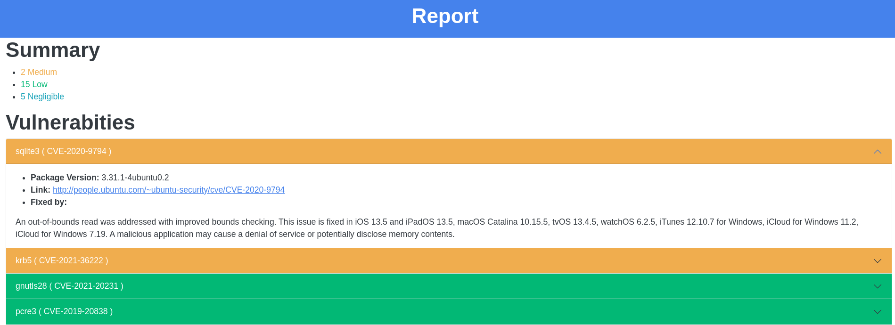

# `Clairson2HTML`
Super tiny JavaScript app to represent the contents of the `clair-scanner` JSON report in HTML using Bootstrap and Bootswatch frameworks.

> You need an internet connection to see a pretty report because both framworks are loaded with the CDN. If you're looking an offline solution, download the files and embed them into the report's `<head>`

## Usage
You need yo have `node` installed.

You need to:
- Be in the same directory as the JSON report
- Rename de report to `report.json`
- Have writting permissions on the current directory

```
$ node clairson2html.js 
```

## Sample report
And the report will be saved as `report.html`

<div style="text-align: center">



</div>
